<div align="center">


# CodexaX

**AI-native code editor, built on VS Code**

🌐 **[简体中文](./README.md) ｜ English**

[](https://gitee.com/bright-boy/codexa-x)　[](https://github.com/694475668/CodexaX)

</div>

---

> CodexaX is an **AI-native code editor** built on VS Code (code-oss), with built-in AI chat, autonomous Agent, inline completion and codebase semantic search — backed by a self-built multi-model routing backend, account & billing system, and admin console. **Self-hostable.**

## 🎬 Demo Video

<div align="center">

[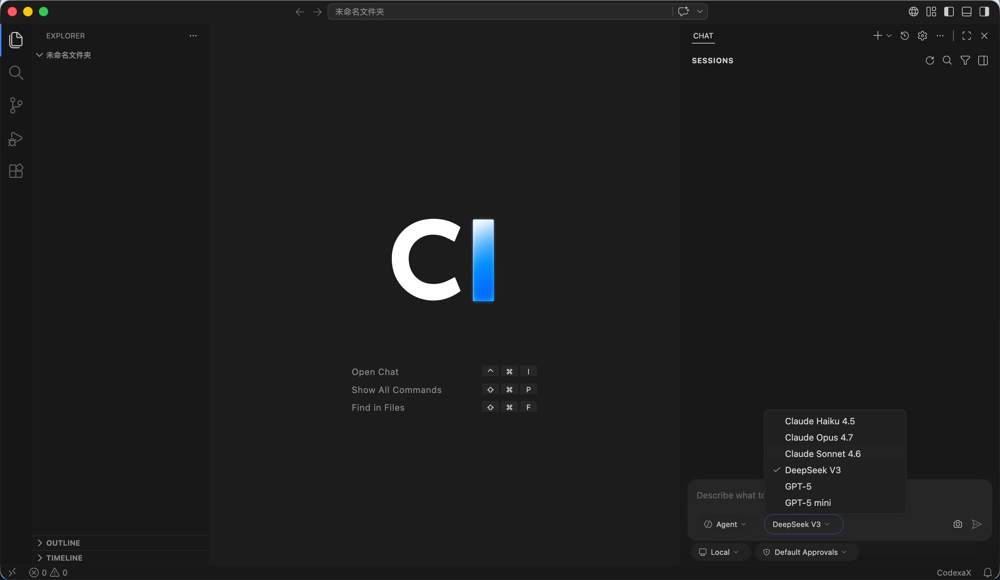](./CodexaX-demo.mp4)

▶️ **[Watch the full demo](./CodexaX-demo.mp4)** (~14 min)

</div>

## ✨ Features

- 🗨️ **AI Chat** — in-editor streaming Q&A, context-aware, Mermaid diagram rendering, multi-session.
- 🤖 **Agent** — autonomous multi-step execution, tool calling, automatic code edits with per-item revert, background tasks.
- ⌨️ **Inline Completion** — cursor-context (FIM) Tab completion, separately rate-limited for low latency.
- 🔍 **Codebase Search (RAG)** — per-workspace vector index + semantic search so the AI understands the whole project.
- 🔀 **Multi-model Routing** — switch between Claude / DeepSeek / GPT / Gemini / xAI / Ollama, unified billing.
- 👤 **Accounts & Billing** — phone OTP login, JWT, SSO, API keys, usage metering, monthly caps, Stripe subscriptions.
- 🛠️ **Admin Console** — manage models / providers / users / usage visually.
- 🚀 **Ops** — auto-update, multi-platform releases, self-hosted deployment.

> Full feature reference: [CodexaX-产品功能说明.md](./CodexaX-产品功能说明.md)

## 📸 Screenshots

### Editor

| | |
|---|---|
|  | 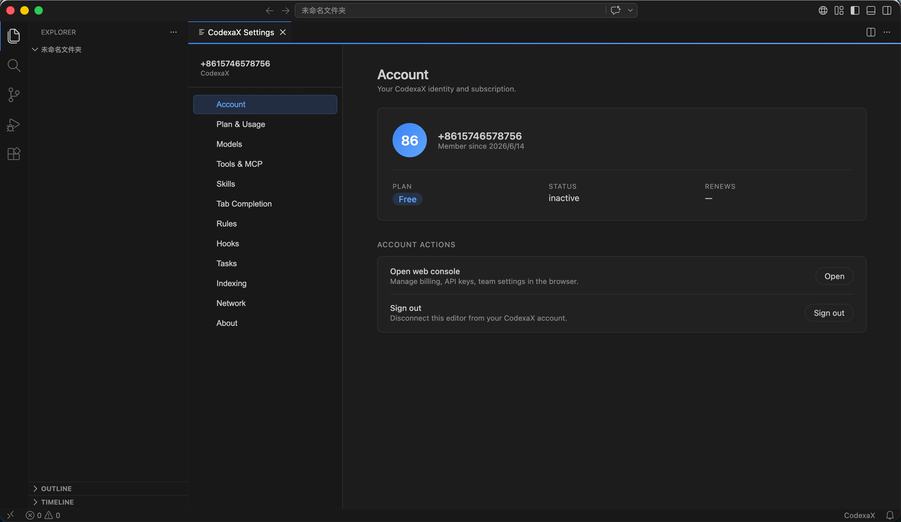 |
| Editor: AI chat panel + Agent mode + multi-model switch | Settings · Account |
| 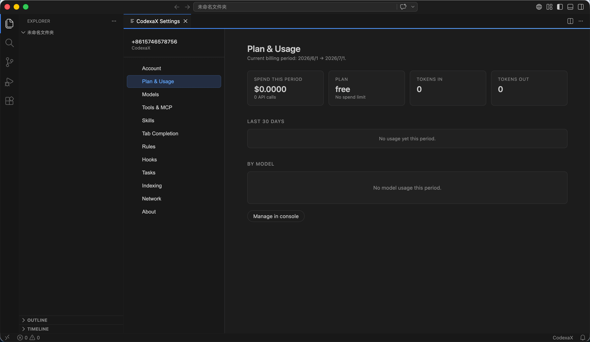 | 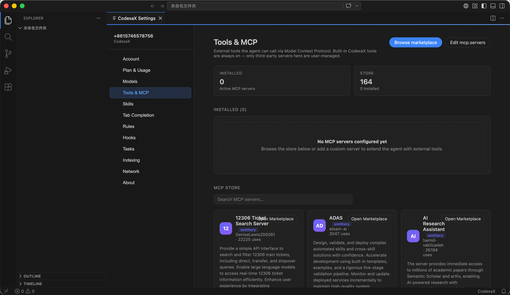 |
| Settings · Plan & Usage | Settings · Tools & MCP (marketplace) |
| 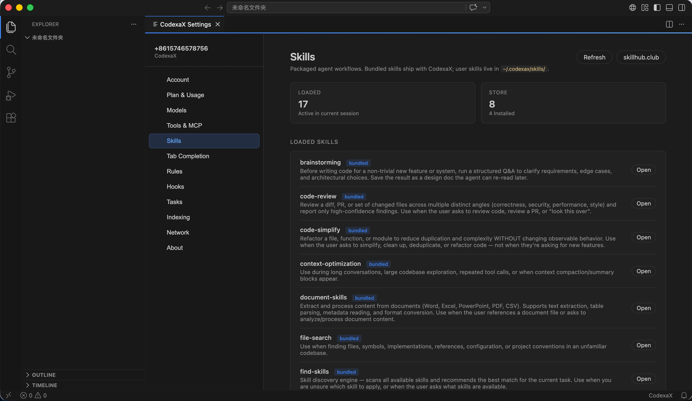 | 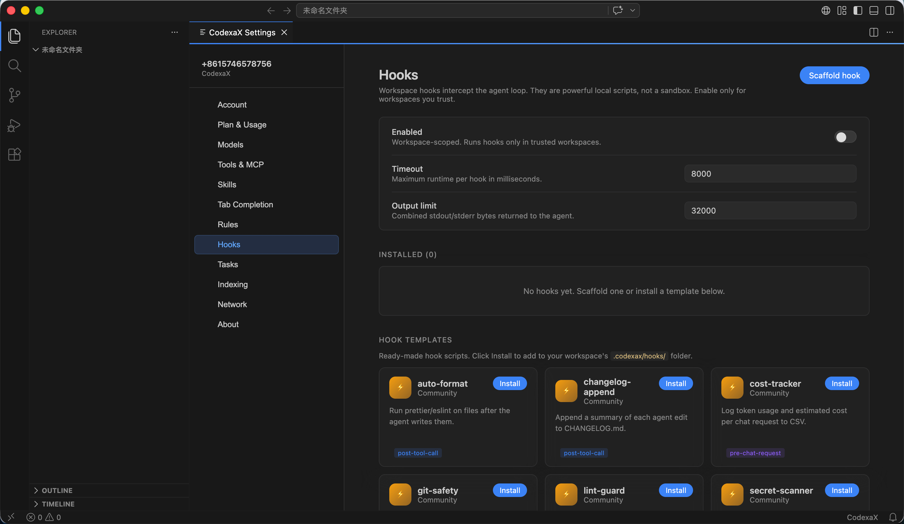 |
| Settings · Skills | Settings · Hooks (workspace hook scripts) |
| 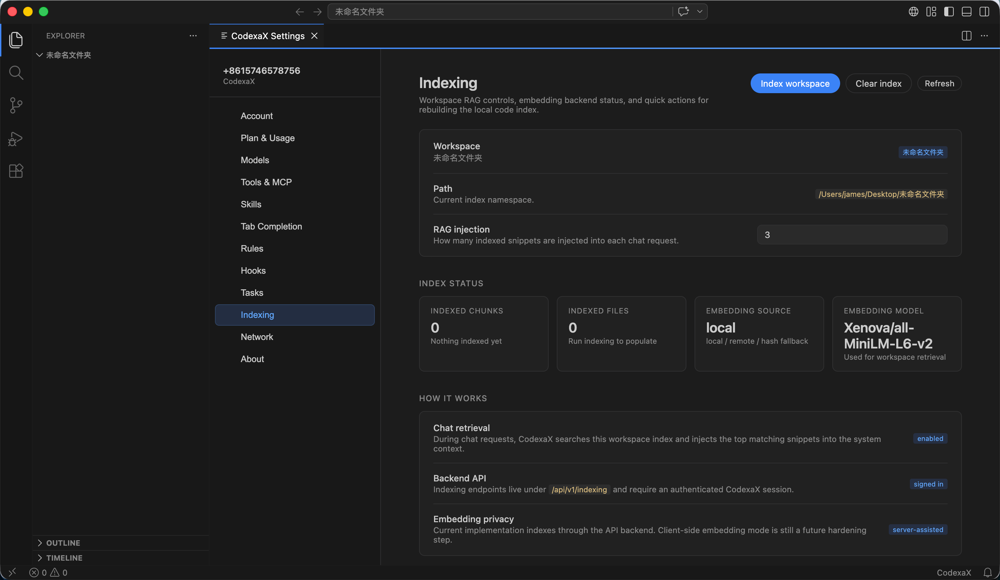 | |
| Settings · Indexing (codebase RAG, local vector search) | |

### Website

| | |
|---|---|
| 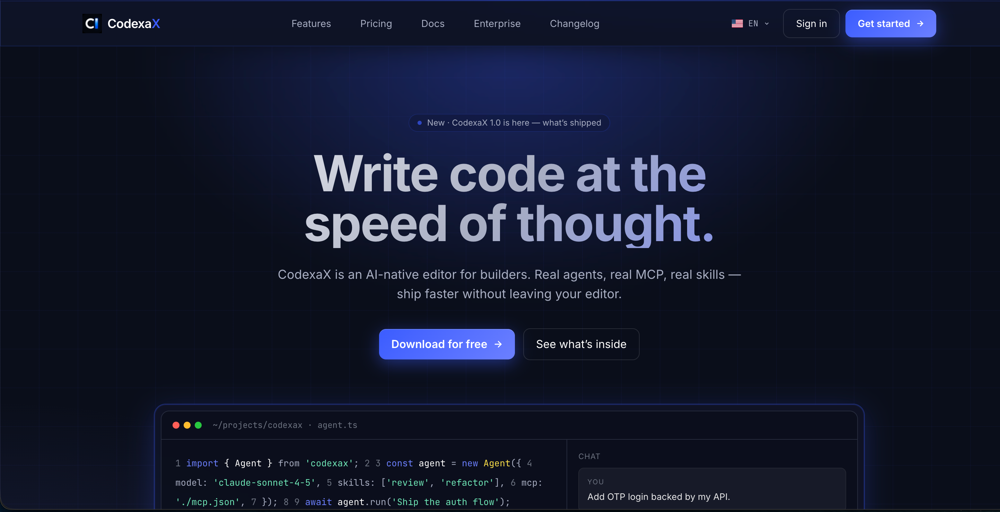 | 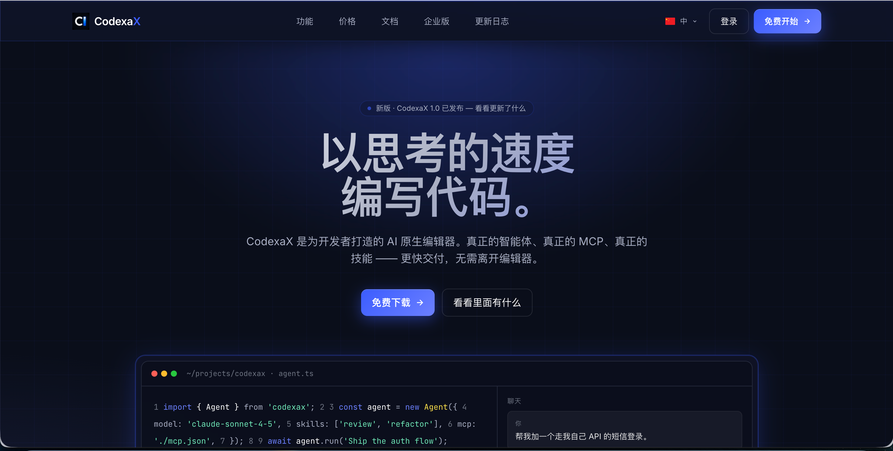 |
| Landing page (English) | Landing page (Chinese) |
| 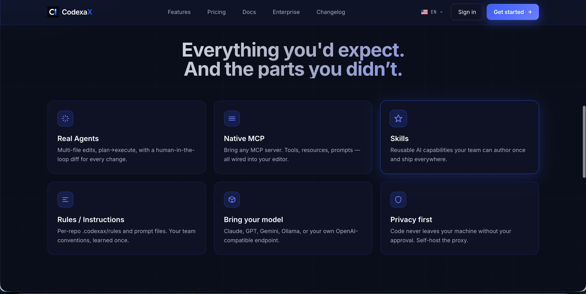 | 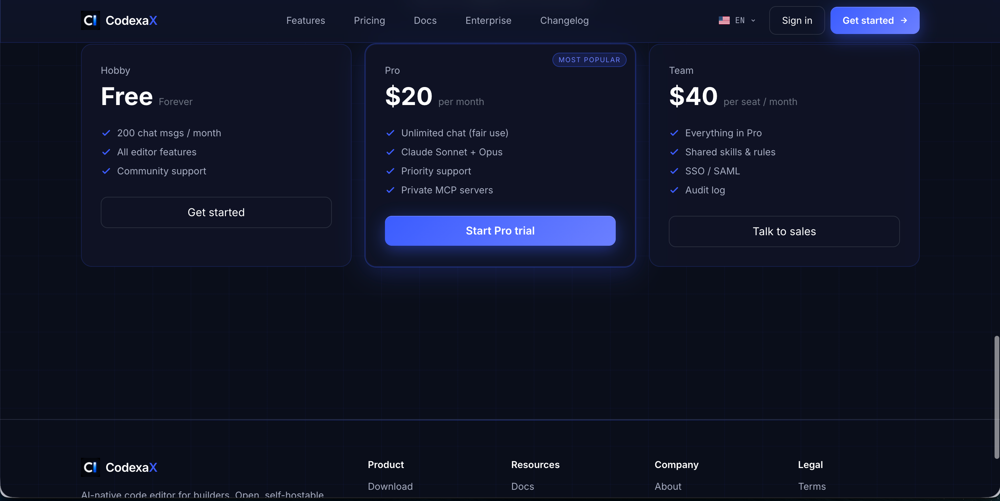 |
| Features: Agents / MCP / Skills / Rules / multi-model | Pricing: Free / Pro / Team |
| 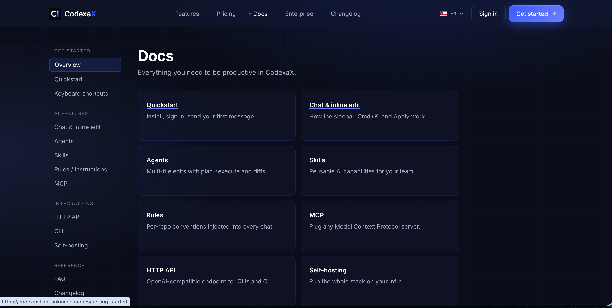 | 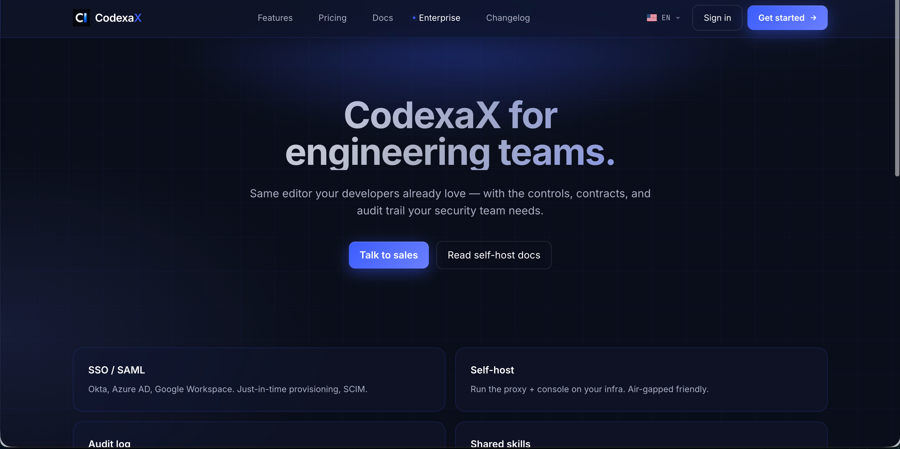 |
| Documentation | Enterprise: SSO / SAML / self-host / audit |
| 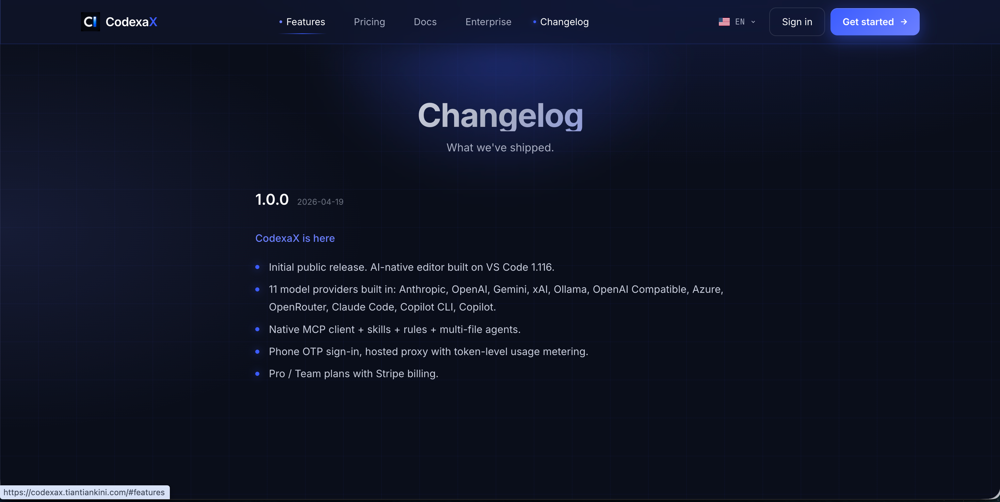 | 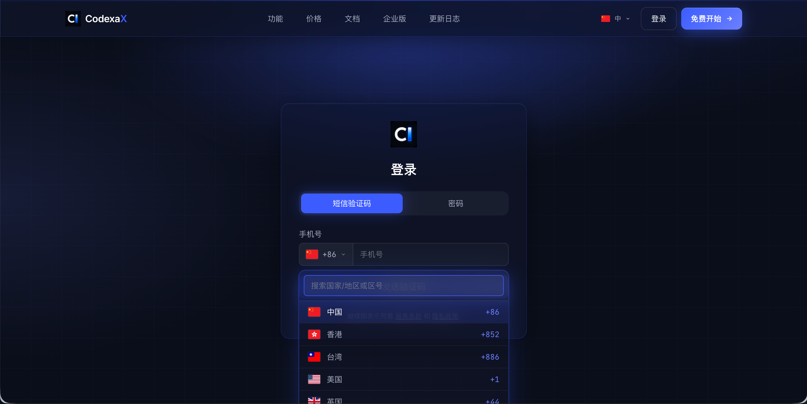 |
| Changelog | Sign in: phone OTP / password |

### User Console

| | |
|---|---|
| 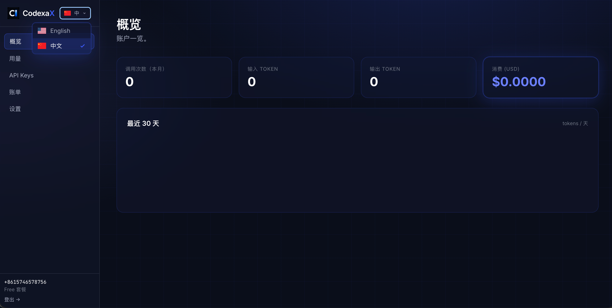 | 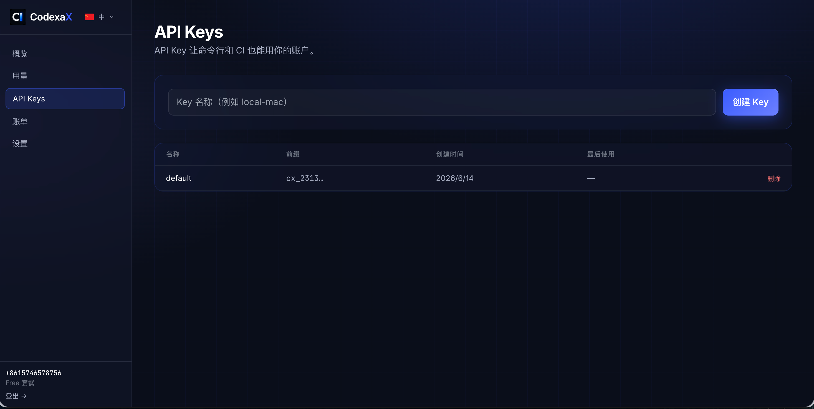 |
| Console overview: calls / tokens / spend | API Keys management |
| 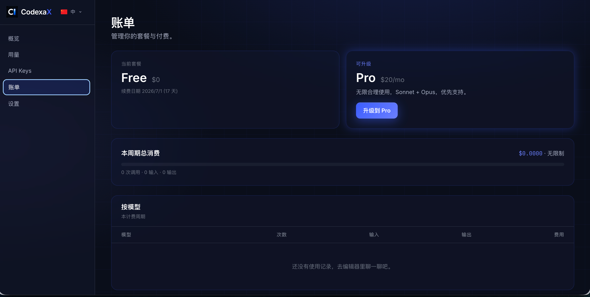 | |
| Billing: plan & usage | |

## 📁 Repository Layout

```
.
├── vscode-src/      # Editor: VS Code (code-oss) fork with CodexaX branding & AI extensions
│   └── extensions/  #   codexax-chat (chat/Agent), codexax-auth (login/multi-model), theme-codexax …
├── codexax/         # Backend monorepo (pnpm workspace)
│   ├── apps/api/    #   API service (Node + Hono + SQLite, port 8787)
│   ├── apps/web/    #   Website (Next.js, port 3000)
│   ├── apps/admin/  #   Admin console (Next.js, port 3001)
│   ├── editor/      #   Editor extension sources
│   └── packages/    #   Shared code
├── 参考源码/         # Reference projects (study only)
├── 截图/             # Screenshots
└── CodexaX-产品功能说明.md
```

## 🚀 Quick Start (Local Dev)

**Requirements**: Node.js ≥ 20, pnpm 9, (editor) Node 22.

**1) Start the backend (API + Web + Admin)**
```bash
cd codexax
pnpm install
pnpm dev
# API   → http://localhost:8787
# Web   → http://localhost:3000
# Admin → http://localhost:3001
```

**2) Start the editor (CodexaX client)**
```bash
cd vscode-src
npm install            # first-time install (compiles native modules)
npm run watch          # continuous build (keep running)
./scripts/code.sh      # launch the editor
```

> In dev mode the editor targets `http://localhost:8787` by default; set `codexax.apiBase` to point at production.

## ⚙️ Configuration

- Backend env vars in `codexax/.env.development` / `.env.production` (ports, `JWT_SECRET`, `DB_PATH`, SMS, Stripe, etc.).
- **Models & providers** are configured visually in the **Admin console** (add models, keys, pricing markup, enable/disable) — no code changes needed.
- Data is stored in SQLite by default; upgradeable to Postgres / pgvector.

## 📦 Deployment

Backend (API + Web + Admin) and the editor client deploy independently: run the backend with PM2 / Docker; the editor ships with a built-in auto-update service (`/update`, `/download`) and supports macOS / Windows / Linux builds. You retain full control of model keys and data.

## 🔗 Repositories

- Gitee: https://gitee.com/bright-boy/codexa-x
- GitHub: https://github.com/694475668/CodexaX

## 📮 Contact

- WeChat: **bright1668**
- QQ: **694475668**

---

<sub>© CodexaX · For demonstration & evaluation. Features may vary by version.</sub>
